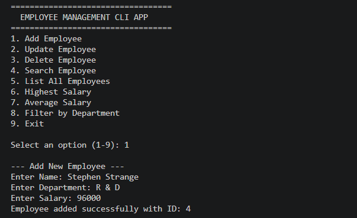
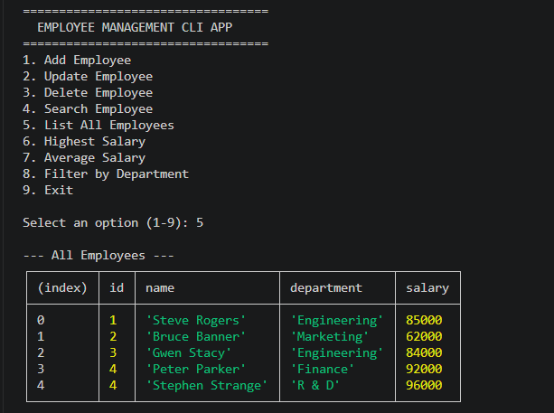

# Day 1: Programming Fundamentals & Problem Solving

This directory contains the Day 1 deliverables for the 10-Day Intern Technical Training & Domain Assessment Program: 15 JavaScript programming exercises and a Node.js Employee Management CLI application.

## Objectives

- Practise programming fundamentals and problem solving.
- Apply core data structures and algorithms.
- Consider time complexity while writing solutions.
- Use Git and document the implementation.

## Contents

```text
day-01/
|-- exercises/                    # 15 solved programming  exercises
|-- employee-management/          # Node.js command-line application
|   |-- index.js
|   `-- package.json
|-- README.md
```

## Exercises

| # | Exercise | Time complexity |
| --- | --- | --- |
| 1 | Print numbers | O(n) |
| 2 | Sum numbers | O(n) |
| 3 | Square pattern | O(n^2) |
| 4 | Number palindrome | O(log n) |
| 5 | Reverse a number | O(log n) |
| 6 | Reverse an array | O(n) |
| 7 | Find the largest array element | O(n) |
| 8 | Count even and odd elements | O(n) |
| 9 | Linear search | O(n) |
| 10 | Binary search (sorted array) | O(log n) |
| 11 | Bubble sort | O(n^2) |
| 12 | Reverse a string | O(n) |
| 13 | String palindrome | O(n) |
| 14 | Character frequency | O(n) |
| 15 | Linked-list implementation and traversal | O(n) |

Each exercise source file includes a single-line comment stating its time complexity.

## Employee Management CLI

The application runs in the terminal and stores employee data in memory for the current session. It supports:

- Add, update, and delete employees
- Search employees by ID or name
- List all employees
- Find the employee with the highest salary
- Calculate the average salary
- Filter employees by department
- Basic input validation for employee name and salary

## Technology

- JavaScript (Node.js)
- Node.js built-in `readline/promises` module
- Git and GitHub

## Run the application

1. Install [Node.js](https://nodejs.org/) (version 18 or later).
2. From the repository root, run:

   ```bash
   cd day-01/employee-management
   node index.js
   ```

3. Choose an option from the menu and follow the prompts.

## Screenshots




## Challenges Faced

- Formatting Output: Standard console logs became unreadable for array lists.

- Data Aggregation: Computing average salary and finding peak values accurately when lists contain variable values.

## Solutions

- Utilized Node's built-in console.table() method to format complex objects cleanly into visual tables.

- Implemented JavaScript functional helpers like .reduce() and .filter() to handle aggregate stats

## Future improvement

Add JSON file persistence so employee records remain available after the program exits.
